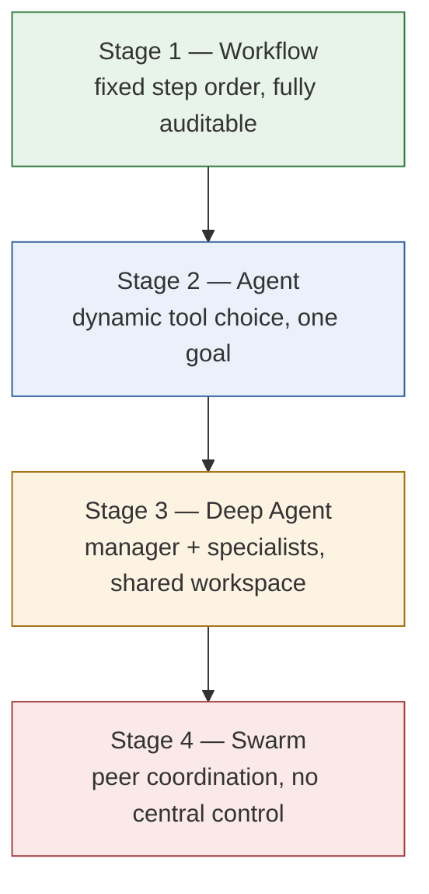

<div align="center">

# ship-the-audit-log

### Three production-grade AI agent patterns, made runnable — not just describable.

*Extracted from how DoorDash actually built agents that survive contact with production, mapped against Andrew Ng's "AI Engineering Skills Map."*

[](https://github.com/arjun-basu001/ship-the-audit-log/actions/workflows/smoke-test.yml)
[](LICENSE)
[](https://www.python.org/downloads/)
[](examples/requirements.txt)
[](#contributing)

[Why this repo exists](#why-this-repo-exists) •
[The three patterns](#the-three-patterns) •
[Quickstart](#quickstart) •
[Repo structure](#repo-structure) •
[Ng's pillars, mapped](#andrew-ngs-four-pillars-mapped-to-production) •
[Sources](#sources)

</div>

---

## Why this repo exists

Most "AI agent" content optimizes for one metric: autonomy. How many steps it can take unsupervised, how little oversight it needs. That metric has never once appeared on an income statement.

DoorDash's engineering team published a different story. An in-house AI code reviewer running 10,000+ PRs a week across 56 repos. A 60.2% acceptance rate on what it flags, meaning engineers actually act on it. A platform, Flux, processing 130,000 engineering tasks in a single month, at roughly $3 a review against $5–20 for commercial tools.

None of that came from a smarter model. It came from three deliberate, unglamorous engineering decisions — the kind that don't make it into a conference talk because they don't demo well:

1. **Don't skip maturity levels.** Workflow → Agent → Deep Agent → Swarm is a ladder, not a menu. Most tasks belong on a lower rung than the hype wants you to believe.
2. **Put a trust boundary between the agent and everything it can touch.** Scoped, audited tool access, not raw credentials, is what makes an agent safe to run unattended.
3. **Split noticing from verifying.** An agent that's good at spotting *candidate* problems is not the same system as one that's good at confirming them. Conflating the two is why most "smart" review bots get ignored within a month.

Each pattern gets a doc for the *why* and a runnable example for the *how*. No API key required — every example uses a swappable stub in place of a real model call, so what you're inspecting is the architecture, not a particular vendor's output.

> Companion repo for the article **"DoorDash's AI Agents Aren't Smarter Than Yours. They're Just Better Engineered."** — the article makes the argument, this repo lets you run it.

---

## The three patterns



Climb only as far as the task actually requires — cost and debuggability get worse at every stage. Each is implemented on the *same* toy task in [`examples/01_maturity_ladder/`](examples/01_maturity_ladder), so the difference in shape is visible in one run instead of across four separate reads.

| # | Pattern | The idea | Doc | Runnable example |
|---|---|---|---|---|
| 1 | **Maturity ladder** | Workflow → Agent → Deep Agent → Swarm. Build robust single-agent primitives before reaching for multi-agent orchestration — it amplifies a shaky primitive, it doesn't fix one. | [`docs/01-maturity-ladder.md`](docs/01-maturity-ladder.md) | [`examples/01_maturity_ladder/`](examples/01_maturity_ladder) |
| 2 | **Trust boundary** | Agents talk to a scoped, audited gateway — never to your systems directly. An agent with unscoped access isn't an employee, it's an intern with root and no manager. | [`docs/02-trust-boundary-pattern.md`](docs/02-trust-boundary-pattern.md) | [`examples/02_tool_gateway/`](examples/02_tool_gateway) |
| 3 | **Disprove-it gate** | Precision over recall, enforced as an actual control-flow gate: every finding has to survive an attempt to falsify it before a human ever sees it. | [`docs/03-precision-over-recall-evals.md`](docs/03-precision-over-recall-evals.md) | [`examples/03_disprove_it_eval/`](examples/03_disprove_it_eval) |

---

## Quickstart

```bash
git clone https://github.com/arjun-basu001/ship-the-audit-log.git
cd ship-the-audit-log

# stdlib only — nothing to install
python3 examples/01_maturity_ladder/run_all.py
python3 examples/02_tool_gateway/demo.py
python3 examples/03_disprove_it_eval/eval_harness.py
```

Each script prints what's happening at every decision point — read the output next to the source, not just the final line. To wire in a real model, replace the one function in each example marked `# swap for a real model call`; everything else, the gateway, the gate, the ladder, works unchanged, because that's the entire point of the pattern.

---

## Repo structure

```
ship-the-audit-log/
├── README.md
├── LICENSE
├── .github/workflows/smoke-test.yml     ← CI runs every example on every push
├── docs/
│   ├── 01-maturity-ladder.md            ← Workflows → Agents → Deep Agents → Swarms
│   ├── 02-trust-boundary-pattern.md     ← why raw credentials on an agent are a design bug
│   ├── 03-precision-over-recall-evals.md ← "volume without unit-cost and quality gates is a vanity trap"
│   └── 04-ng-skills-map-to-production.md ← Ng's four pillars mapped to DoorDash's public numbers
└── examples/
    ├── 01_maturity_ladder/              ← the same task, built 4 ways
    ├── 02_tool_gateway/                 ← scoped, audited tool access — and what happens without it
    └── 03_disprove_it_eval/             ← a reviewer that has to falsify its own findings before posting them
```

---

## Andrew Ng's four pillars, mapped to production

Ng's ["AI Engineering Skills Map"](https://www.deeplearning.ai/the-batch/the-ai-engineering-skills-map) names four pillars, built from 10,000+ job postings and industry survey data. Read next to DoorDash's public engineering writeups, they stop looking like theory and start looking like a description of something that already shipped.

| Ng's pillar | What it means in practice | Where it lives in this repo |
|---|---|---|
| Building & deploying AI systems | Evals and error analysis, not vibes | [`examples/03_disprove_it_eval`](examples/03_disprove_it_eval) |
| Software engineering fundamentals | Cost, security, and reliability tradeoffs decided up front | [`examples/02_tool_gateway`](examples/02_tool_gateway) |
| Using coding agents well | Knowing when an agent should act vs. flag for review | [`examples/01_maturity_ladder`](examples/01_maturity_ladder), [`examples/03_disprove_it_eval`](examples/03_disprove_it_eval) |
| Shaping the build | Deciding what "good enough to ship" means before you build it | [`docs/03-precision-over-recall-evals.md`](docs/03-precision-over-recall-evals.md) |

Full write-up: [`docs/04-ng-skills-map-to-production.md`](docs/04-ng-skills-map-to-production.md).

---

## Contributing

Issues and PRs are welcome, especially:

- A fourth pattern with the same "doc explains why, code proves it" shape
- A real-model adapter (OpenAI, Anthropic, local) dropped in behind the existing stub interface
- Sharper fixtures for `examples/03_disprove_it_eval` — more realistic true/false findings make the precision numbers more convincing

Keep additions dependency-free where possible; the zero-dependency constraint is intentional, not an oversight.

## Sources

- DoorDash Engineering — ["How DoorDash built an AI code reviewer engineers actually listen to"](https://careersatdoordash.com/blog/doordash-built-an-ai-code-reviewer-engineers-actually-listen-to/)
- DoorDash Engineering — ["Beyond Single Agents: How DoorDash is building a collaborative AI ecosystem"](https://careersatdoordash.com/blog/beyond-single-agents-doordash-building-collaborative-ai-ecosystem/)
- DoorDash AI Research ([@AIatDoorDash](https://x.com/AIatDoorDash)) — Flux platform announcement
- Andrew Ng — ["The AI Engineering Skills Map"](https://www.deeplearning.ai/the-batch/the-ai-engineering-skills-map), The Batch, DeepLearning.AI

## License

MIT — see [`LICENSE`](LICENSE). Use it, fork it, argue with it.

---

<div align="center">

*Ship the audit log before you ship the autonomy.*

</div>
